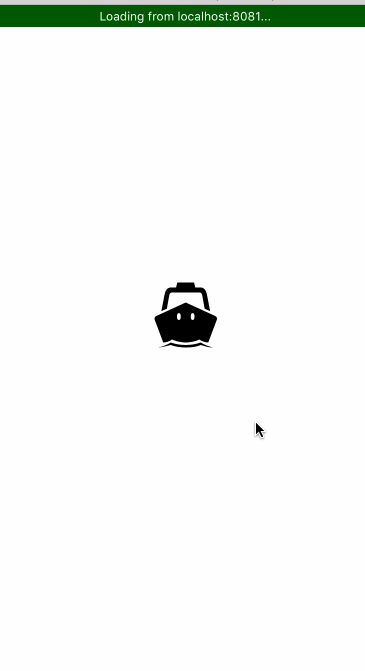

# WeTogether

>  基于React-Native的生活向APP。

## 项目描述
1. 基于React-Native框架开发，能同时运行在Android、iOS环境下。
2. 涵盖了图文、音乐、电影、咨询四大块.

## APP截图
 

 

 

 

## 整体思路
1. redux 管理数据流，react-navigation 路由。 项目文件的放置采取就近原则。

## Build
1. clone this repository
2. npm install
3. react-native run-android or react-native run-ios

## 第三方库
1. [redux](https://github.com/reactjs/redux)
2. [react-redux](https://github.com/reactjs/react-redux)
3. [redux-thunk](https://github.com/gaearon/redux-thunk)
4. [redux-actions](https://github.com/reduxactions/redux-actions)
5. [react-native-video](https://github.com/react-native-community/react-native-video)
6. [react-navigation](https://github.com/react-community/react-navigation)
7. [react-native-viewpager](https://github.com/race604/react-native-viewpager)
8. [react-native-vector-icons](https://github.com/oblador/react-native-vector-icons)
9. [react-native-swiper](https://github.com/leecade/react-native-swiper)
10.[react-native-scrollable-tab-view](https://github.com/skv-headless/react-native-scrollable-tab-view)
11. [react-native-lightbox](https://github.com/oblador/react-native-lightbox)
12. [react-native-htmlview](https://github.com/jsdf/react-native-htmlview)
13. [react-native-app-intro](https://github.com/FuYaoDe/react-native-app-intro)

